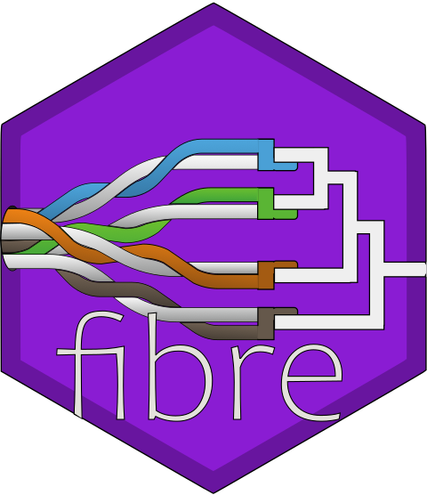

<!-- README.md is generated from README.Rmd. Please edit that file -->

# fibre <a href="https://rdinnager.github.io/fibre/"></a>

<!-- badges: start -->

[](https://github.com/rdinnager/fibre/actions/workflows/R-CMD-check.yaml)
[](https://zenodo.org/badge/latestdoi/316467300)
<!-- badges: end -->

The goal of fibre is to …

## Installation

You can install the development version of fibre from
[GitHub](https://github.com/) with:

``` r
# install.packages("devtools")
devtools::install_github("rdinnager/fibre")
```

## Example

This is a basic example which shows you how to solve a common problem:

``` r
library(fibre)
## basic example code
```
