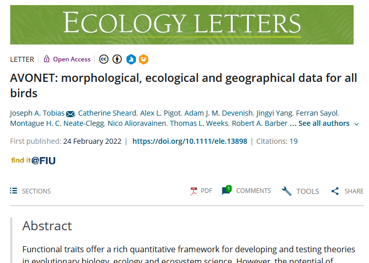
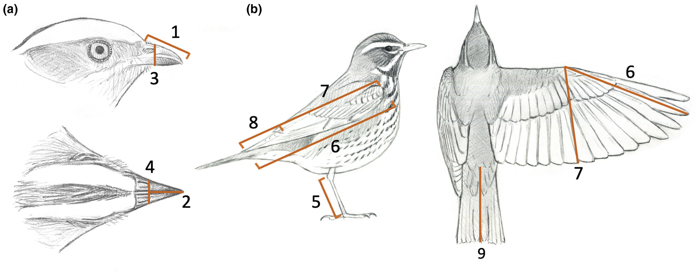

```{css echo=FALSE}
@media print {
  .topicsContainer,
  .topicActions,
  .exerciseActions .skip {
    display: none;
  }
  .topics .tutorialTitle,
  .topics .section.level2,
  .topics .section.level3:not(.hide) {
    display: block;
  }
  .topics {
    width: 100%;
  }
  .tutorial-exercise, .tutorial-question {
    page-break-inside: avoid;
  }
  .section.level3.done h3 {
    padding-left: 0;
    background-image: none;
  }
  .topics .showSkip .exerciseActions::before {
    content: "Topic not yet completed...";
    font-style: italic;
  }
}
```

```{r setup, include=FALSE}
library(learnr)
library(fibre)

custom_checker <- function(label, user_code, check_code, envir_result, evaluate_result, envir_prep, last_value, stage, ...) {
  # this is a code check
  if(stage == "check") {
    
    rstudioapi::sendToConsole(user_code, focus = TRUE)
    
    fofpack::set_env(envir_result)

    list(message = "Code Run!", correct = TRUE, type = "success", location = "append")
    
  }

}

knitr::opts_chunk$set(echo = FALSE)

```

## Introducing `{fibre}`

- `{fibre}` is a phonetic respelling of the acronym PhyBR: *Phy*logenetic *B*ranch *R*egression
- `{fibre}` implements fast and flexible evolutionary models of traits on phylogenies
- Both for inference of rates of evolution of traits and for phylogenetic comparative methods

## The Basis of Phylogenetic Branch Regression

- Phylogenetic flows
  - An information flow through a tree-structured graph from a root node to a set of terminal nodes.
- Characterized by a (sparse) matrix: The root to node matrix
- Each row represents a flow from the root to a terminal node (usually tips, but not necessarily)
- Each column represents a branch of the phylogeny which each flow either flows through or doesn't (in which case it is zero)
- The structure of the phylogenetic tree is completely determined by the sparsity structure of the matrix
- The values of the non-zero elements can be branch lengths or any data associated with the phylogeny's edges

## Phylogenetic Flows as a Data Structure

- The package `{phyf}` handles phylogenetic flows as a type of `data.frame` or `tibble`
- Makes it easy to combine a phylogeny with data

## A simple example

```{r phyf_intro, exercise=TRUE}
set.seed(4534)
library(fibre)
library(phyf)
library(ape)
library(tidyverse)
library(ggtree)
library(ggplot2)
library(patchwork)
library(latex2exp)
tree <- rcoal(4)
plot(tree, show.node.label = TRUE)
```

```{r phyf_intro-check}
ls()
```

## As a `pfc` object

- A `pfc` is a phylogenetic flow object
- Note that the root node is not contained in a `pfc` because it has no edge leading to it
- The notion of a root edge makes little sense in the context of phylogenetic flows

```{r phyf_intro2, exercise=TRUE}
tree_pfc <- pf_as_pfc(tree)
tree_pfc
```

```{r phyf_intro2-check}
ls()
```

## Tips vs. Nodes

- By default new `pfc` objects always have tips and internal nodes
- In practice, only the tip elements are useful for fitting models
- Internal node elements are useful for predicting ancestral states once a model is fit
- The entire tree structure is represented in the tip elements of the phylogenetic flow because in the set of flows from the root to all of the tips, all internal nodes must have been flowed through at least once

---

## Tips vs. Nodes

```{r phyf_intro3, exercise=TRUE}
tree_tips <- pf_tips(tree_pfc)
tree_tips

plot(pf_as_phylo(tree_pfc))
plot(pf_as_phylo(tree_tips))
```

```{r phyf_intro3-check}
ls()
```

## A Phylogenetic Flow object can be represented as sparse matrix

```{r phyf_intro4, exercise=TRUE}
pf_as_sparse(tree_pfc)
```

```{r phyf_intro4-check}
ls()
```

## Visualise sparse matrix

## Why does this matter?
### A Model of trait Evolution

- Evolution of a trait can be expressed simply in terms of phylogenetic flow.
- A trait at the tip of the tree is equal to the value of the trait at the root plus the sum of the evolutionary changes along each branch between that tip and the root, that is, along the phylogenetic flow for that tip.
- Generally we want to put this in terms of the rates of evolution, such that the change in the trait along each branch is the rate times the branch length.

$$\text{trait}_i = \text{trait}_0 + \sum_{e \subset \text{flow}_i} l_e r_e$$
Where $\text{trait}_0$ is the trait value at the root node.

## With `{phyf}` we can do tree 'arithmetic'

```{r tree_arith, exercise=TRUE}
rates <- matrix(rnorm(6), nrow = 1)
rates

tree_pfc
tree_pfc * rates
```

```{r tree_arith-check}
ls()
```

## With `{phyf}` we can do tree 'arithmetic'

```{r tree_arith2, exercise=TRUE}
root <- 2
root + pf_flow_sum(tree_pfc * rates)
```

```{r tree_arith2-check}
ls()
```

## But that whole procedure can be done with one matrix multiplication

```{r tree_arith3, exercise=TRUE}
root + pf_flow_sum(tree_pfc * rates)
root + pf_as_sparse(tree_pfc) %*% t(rates)
```

```{r tree_arith3-check}
ls()
```

## This is very efficient

- Simulate trait evolution on large tree

```{r sim_vert, exercise=TRUE}
vert_bmr
sum(vert_bmr$is_tip)
```

```{r sim_vert-check}
ls()
```

---

```{r sim_vert2, exercise=TRUE}
system.time(
  traits <- root + pf_as_sparse(vert_bmr) %*% matrix(rnorm(pf_nedges(vert_bmr$phlo)))
)
autoplot(vert_bmr %>% mutate(sim_trait = traits[ , 1]), sim_trait)
```

```{r sim_vert2-check}
ls()
```

## But how to we estimate the parameters?

- One parameter per edge (the rates): $n_{edge} = n_{tips} + (n_{tips} - 1)$ for bifurcating tree
- $n_{edge} > n_{tips}$: the number of parameters exceeds the number of data points 
- Generally, this problem is solved by adding additional constraints on the model so that parameters are not completely 'free'
- In a Bayesian framework, this is achieved with prior distributions

## Let's put a simple Gaussian prior on our rates

$$\text{trait}_i = \text{trait}_0 + \sum_{e \subset \text{flow}_i} l_e r_e + \text{error}_i$$
$$\text{error}_i \sim \text{Normal}\left(0, \sigma^2\right)$$
$$r_e \sim \text{Normal}\left(0, \tau^2\right)$$
## What is this model?

- I call it Phylogenetic Branch Regression (PhyBR, or fibre, phonetically)
- This model is trivial to fit in a number of Bayesian modelling frameworks, including INLA (which uses an Integrated Nested Laplace Approximation for very fast inference)
- Given the simplicity of this model, has anyone done it before?
- Sort of: It is possible to show that the maximum a posterior (MAP) estimate of this model is equivalent to the maximum likelihood solution of phylogenetic ridge regression with penalty factor $\lambda = \frac{\sigma^2}{\tau^2}$

## A relationship with Brownian motion

- Phylogenetic trait models based on Brownian motion are classic models (and often unfairly criticized, more on that later).
- Brownian motion is based on a stochastic process know as the Wiener process. 
- They should be called phylogenetic Wiener models, because the historical connection with the physical process of Brownian motion has not aided our interpretations of this model in my opinion.
- The Wiener process is characterized by four properties:

## In a phylogenetic context, this all adds up to...

- The change in a trait along the edges of a phylogeny are distributed according to

$$\Delta\text{trait}_e \sim \text{Normal}\left(0, \phi^2 l_e\right)$$
where $\phi^2$ is the evolutionary 'rate' parameter (more often referred to as $\sigma^2$, but I reserve that for the observation-level error distribution). But:
$$\Delta\text{trait}_e = l_e r_e$$
----

So we have:

$$l_e r_e \sim \text{Normal}\left(0, \phi^2 l_e\right)$$
and therefore:

$$\frac{l_e r_e}{l_e} \sim \text{Normal}\left(0, \frac{\phi^2 l_e}{l_e^2}\right)$$
$$r_e \sim \text{Normal}\left(0, \phi^2 \sqrt l_e\right)$$

## A Phylogenetic Wiener Process Model

- So this (highly efficient) model is equivalent to a Wiener Process when using square root transformed edge lengths!
- This also implies that the plain fibre model is equivalent to phylogenetic Brownian motion with squared branch-lengths (which also happens to be equivalent to a Pagel's Kappa model with $\kappa = 2$) 

## How is {fibre} different than a standard phylygenetic 'Brownian Motion' model?

- It is equivalent in it's predictions and estimate of the hyper-parameters (e.g. the evolutionary 'rate' parameter), but parameterizing the model at the level of individual branch rates is powerful.
- Since the original definition of the model by Felsenstein, typically a 'tip-level' covariance structure is derived from the assumptions that we just spoke about
- For traditional methods, generally branch-level rates are not estimated as part of the model, and ancestral character estimates can only be calculated using post-hoc methods
- {fibre} models estimate rates as part of the model fitting, and ancestral traits are trivial to estimate using phylogenetic flows to internal nodes.

## Computational Advantages

- The traditional phylogenetic covariance matrix has a dense inverse
- The inverse is the precision matrix of the tips, and it encodes patterns of conditional independence

```{r cophenetic, exercise=TRUE}
ttree <- rcoal(6)
plot(ttree)
covar <- Matrix::Matrix(vcv(ttree))
covar
Matrix::solve(covar)
```

```{r cophenetic-check}
ls()
```

## Computational Advantages

- The phylogenetic covariance matrix can be derived from the phylogenetic flow matrix as 
$$\sum_\text{phy} = \sqrt{\sum_{\text{flow}\left[\text{tips}\right]}} {\sqrt{\sum_{\text{flow}\left[\text{tips}\right]}}^\text{T}}$$

```{r cophenetic2, exercise=TRUE}
ttree_pfc <- pf_as_pfc(ttree)
tip_sparse <- pf_as_sparse(sqrt(pf_tips(ttree_pfc)))
covar2 <- tip_sparse %*% Matrix::t(tip_sparse)
all.equal(as.matrix(covar2), as.matrix(covar))
```

```{r cophenetic2-check}
ls()
```

## Computational Advantages

- Including the ancestors makes the precision matrix much sparser
- This is because most tips are conditionally independent when conditioning on their ancestors

```{r cophenetic3, exercise=TRUE}
ttree_pfc <- pf_as_pfc(ttree)
tip_sparse_anc <- pf_as_sparse(sqrt(ttree_pfc))
covar_anc <- tip_sparse_anc %*% Matrix::t(tip_sparse_anc)
covar_anc

Matrix::drop0(Matrix::solve(covar_anc), tol = 0.001)
Matrix::nnzero()
```

```{r cophenetic3-check}
ls()
```

## Computational Advantages

- The precision matrix of the edge rates is an identity matrix
- This is because all edge rates are conditionally independent of each other under the Wiener Process assumptions.
- Why does this matter?
  - Sparse conditional dependence can be taken advantage of in computational frameworks that can take this sparsity into account.
  - `{fibre}` uses to computational 'engines' that can take advantage of sparsity: `{INLA}`, and `{glmnet}`

** Conclusion: **
- `{fibre}` is extremely fast!

## A Phylogenetic Effect

- {fibre} implements what is essentially a random effect of the following form

$$\mu_i = \sum_j\mathbf{F_{i, .}} r_j$$
$$r_j \sim \text{Normal}\left(0, \phi^2\right)$$
where $\mathbf{F}$ is the phylogenetic flow matrix, and $r$ is a row vector of evolutionary rates of length $n_\text{edge}$. Here, $\mu$ is a column vector of deviations with phylogenetic structure. 

- We will compactly refer to the above in subsequent equation as: 
$$\mu_i \sim \text{Pflow}\left(\phi^2\right)$$
## A simple Brownian motion model

- Let's do an example
- Run a simple univariate phylogenetic Brownian motion model on body mass of most birds
- The `phyf` package includes a `pf` version of AVONET ()

Tobias, J. A., Sheard, C., Pigot, A. L., Devenish, A. J., Yang, J., Sayol, F., ... & Schleuning, M. (2022). AVONET: morphological, ecological and geographical data for all birds. *Ecology Letters*, **25(3)**, 581-597.

```{r image1}


```
---

```{r image2}

```


```{r avonet, exercise=TRUE}
avonet
```

```{r avonet-check}
ls()
```

## A simple Brownian motion model!

Mathematically the model is:

$$\text{log(Mass}_i + 1) = \text{root}_0 + \mu_i + e_i$$
$$\mu_i \sim \text{Pflow}\left(\phi^2\right); e_i \sim \text{Normal}\left(0, \sigma^2\right)$$
## A simple Brownian motion model!

In {fibre} the default error family is 'gaussian', which implicitly fits a normally distributed error term.  
So to fit the model in `{fibre}`, you run:

```{r model_brownian, exercise=TRUE}
mod <- fibre(scale(log(Mass + 1)) ~ bre_brownian(phlo),
             data = avonet)
mod
```

```{r model_brownian-check}
ls()
```

## Predictions

- It is simple to generate predictions from the model. Since the `pf` object included ancestral nodes in it, predictions include ancestral character estimates.

```{r preds1, exercise=TRUE}
preds <- predict(mod, avonet)
preds
```

```{r preds1-check}
ls()
```

## Predictions

- `preds` has all `r sum(!avonet$is_tip)` ancestral character estimates as well as tip-level prediction for the model. We can see how well the model was able to predict the tip values by just plotting the predictions against the observed values.

```{r preds_tips, exercise=TRUE}
avonet_w_preds <- avonet %>% bind_cols(preds) %>%
  mutate(.obs = scale(log(Mass + 1)))

ggplot(avonet_w_preds, aes(.obs, .pred_mean)) +
  geom_point() + geom_abline(intercept = 0, slope = 1, linetype = 2,
                             colour = "white", size = 1.25)

```

```{r preds_tips-check}
ls()
```

## Predictions

- It actually takes longer to plot the whole tree with ancestral estimates than it does to fit the model, so I won't plot the whole tree here.
- Instead I will show a subtree
- With `{phyf}` we can easily subset the `pf` object to a particular clade, which will take all the predictions with it

```{r preds2, exercise=TRUE}
water_bird_preds <- avonet_w_preds %>%
  filter(pf_is_desc(phlo, pf_mrca(phlo[c("Platalea_minor", "Pelecanus_occidentalis")])))
p <- autoplot(water_bird_preds, 
              .pred_mean,
              layout = "rectangular") + xlim(0, 100)
p
```

```{r preds2-check}
ls()
```

## Prediction Uncertainty

- Because this `fibre` model is a fully Bayesian method, uncertainty in any estimate can easily be represented with the standard deviation of the posterior distribution.
- Predictions automatically include this information in `.pred_sd`, and we can then plot them in the same way as with the prediction means:

```{r preds3, exercise=TRUE}
p2 <- autoplot(water_bird_preds, 
              .pred_sd,
              layout = "rectangular") + xlim(0, 100)
p2
```

```{r preds3-check}
ls()
```

## Get an Order subtree

- We can use tools from `{phyf}` to extract an order-level subtree:

```{r preds4, exercise=TRUE}
Galliformes_preds <- avonet_w_preds %>%
  filter(pf_is_desc(phlo, pf_mrca(phlo[which(Order3 == "Galliformes")])))
p3 <- autoplot(Galliformes_preds, 
              .pred_mean,
              layout = "circular") + xlim(0, 100) 
p3
```

```{r preds4-check}
ls()
```

## Uncertainty

```{r preds5, exercise=TRUE}
p4 <- autoplot(Galliformes_preds, 
               .pred_mean,
               layout = "circular",
               suppress_tiplabels = TRUE) + 
  autoplot(Galliformes_preds, 
           .pred_sd,
           layout = "circular",
           suppress_tiplabels = TRUE) 
p4
```

```{r preds5-check}
ls()
```

## But this is just a 'Brownian Motion' model, right?

- The philosphy of `{fibre}` models
  - Estimate edge-wise rates, the phylogenetic 'model' is a prior distribution used to 'encourage' values to have a simple, compact form. The data can actually pull the values away from the prior distribution.
  - The phylogenetic model should be simple to reduce issues of identifiability (the 'Wiener Process' already makes the intercept unidentifiable without further constraints, more complex models are worse).
  - More complicated data (e.g. high-dimensional and/or non-continuous and/or highly structured) is modeled as a function of phylogenetically constrained 'latent' variables.
  - Any models that can be achieved by a branch-length transformation (e.g. 'OU models') is better handled by a transformation of the latent variables or the data itself. 
  - Computation of the model should be done with standard statistical 'engines' that take care of the complicated task of stable computation. Among other advantages, this means {fibre} models are theoretically combinable with many other non-phylogenetic statistical models
  
## 'Brownian Motion' models are not mechanistic

- Using a Weiner Process model is not equivalent to assuming traits evolve 'randomly' like a particle in a gas.
- It is, ultimately, just a prior distribution. 'Brownian motion' models are far more flexible than most of us realise!
- For example:

```{r gaussian_assumption, exercise=TRUE}
rates <- mod$random[[1]]$mean
hist(rates, breaks = 100)
qqnorm(rates)
qqline(rates)
```

```{r gaussian_assumption-check}
ls()
```

## What are the most extreme rates?

```{r gaussian_assumption2, exercise=TRUE}
avonet_rates <- avonet %>%
  left_join(mod$random[[1]] %>%
              select(label = ID,
                     rate = mean)) %>%
  mutate(extreme_rate = scale(rate)[ ,1] > 4)
```

```{r gaussian_assumption2-check}
ls()
```

## More Complicated Models

Some model classes `fibre` can (or will) fit:

- Non-Gaussian Response (e.g. Binomial, Multinomial, Negative Binomial, Poisson, Zero-inflated Poisson, Gamma, Beta-Binomial, and many more)
- Multiple phylogeny models
  - Blend multiple branch-length transformations together (Pagel's models)
  - Species interaction models, where the 'trait' is a property of two interacting groups of species (e.g. host-parasite interactions)
- Phylogenetic 'Mixture' Models
  - 'Traits' are measured not at the species-level but as an aggregate of multiple species (e.g. community ecosystem function)
- Multivariate Models
  - Uses a latent variable approach (phylogenetic factor analysis, or for deep-learning methods, 'encoder'-based model)

## Multivariate Example

- The default multivariate model in `{fibre}` is fit with `{INLA}`, and uses a linear function of latent variables (with the error term omitted for brevity):

$$\text{trait}_{i,j} = \text{root}_j + \sum_k\beta_{j, k}\mu_{i, k}$$
$$\mu_{i, k} \sim \text{Pflow}\left(\phi_k^2\right)$$

```{r multivariate, exercise=TRUE}
avonet_beaks <- avonet %>%
  mutate(Beak.Length_Culmen_tr = scale(log(Beak.Length_Culmen + 1))[ , 1],
         Beak.Length_Nares_tr = scale(log(Beak.Length_Nares + 1))[ , 1],
         Beak.Width_tr = scale(log(Beak.Width + 1))[ , 1],
         Beak.Depth_tr = scale(log(Beak.Depth + 1))[ , 1]) %>%
  dplyr::select(label, phlo, Beak.Length_Culmen_tr:Beak.Depth_tr)

mod_mult <- fibre(Beak.Length_Culmen_tr + Beak.Length_Nares_tr + Beak.Width_tr + Beak.Depth_tr ~ bre_brownian(phlo, latent = 2),
                  data = avonet_beaks,
                  engine_options = list(verbose = TRUE))
```

```{r multivariate-check}
ls()
```


## A tale of two phylogenies

```{r interaction, exercise=TRUE}
mod_int <- fibre(EFFECTSIZE1 ~ bre_brownian(plant_phlo) + bre_brownian(fungus_phlo) + 
                   bre_brownian(plant_phlo * fungus_phlo) +
                   re(PlantSpecies2018) +
                   re(FungalGenus2018) +
                   bre_brownian(fungus_phlo * pf_as_pfc(PlantSpecies2018)) +
                   bre_brownian(plant_phlo * pf_as_pfc(FungalGenus2018)),
                 data = plant_fungus %>%
                   filter(plant_is_tip & fungus_is_tip),
                 engine_options = list(verbose = TRUE))

mod_int
```

```{r multivariate-check}
ls()
```

## Truly complex high-dimensional data
### Time to bring in deep learning!

### Collaborator

Marian Kleinberg - Technische Universität Dortmund (now at Hello Games!)
