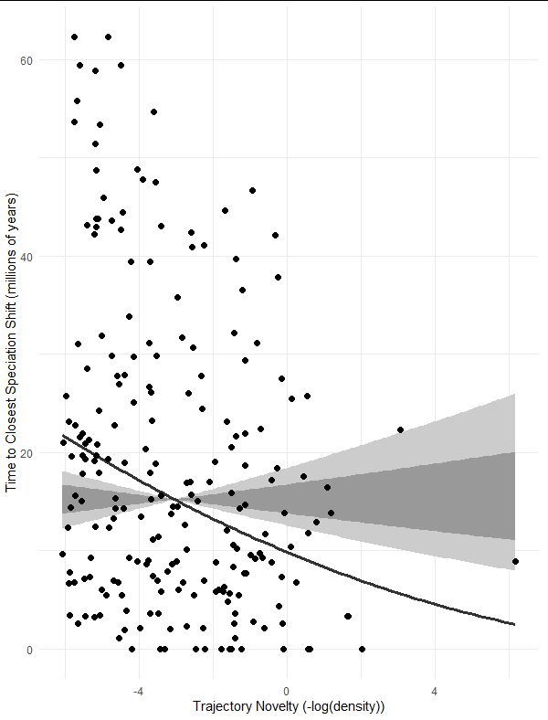

```{css echo=FALSE}
@media print {
  .topicsContainer,
  .topicActions,
  .exerciseActions .skip {
    display: none;
  }
  .topics .tutorialTitle,
  .topics .section.level2,
  .topics .section.level3:not(.hide) {
    display: block;
  }
  .topics {
    width: 100%;
  }
  .tutorial-exercise, .tutorial-question {
    page-break-inside: avoid;
  }
  .section.level3.done h3 {
    padding-left: 0;
    background-image: none;
  }
  .topics .showSkip .exerciseActions::before {
    content: "Topic not yet completed...";
    font-style: italic;
  }
}

.fullslide img {
  margin-top: -85px;
  margin-left: -60px;
}
```

```{r, comment="", results="asis", echo=FALSE}
old.hooks <- fansi::set_knit_hooks(knitr::knit_hooks)
```

```{r setup, include=FALSE}
library(learnr)
set.seed(4534)
library(fibre)
library(phyf)
library(ape)
library(tidyverse)
library(ggtree)
library(ggplot2)
library(patchwork)
library(latex2exp)
library(GGally)
library(movMF)
library(torch)
library(rgl)

# local({
#   old.hooks <- fansi::set_knit_hooks(knitr::knit_hooks)
# })

custom_checker <- function(label, user_code, check_code, envir_result, evaluate_result, envir_prep, last_value, stage, ...) {
  # this is a code check
  if(stage == "check") {
    
    rstudioapi::sendToConsole(user_code, focus = TRUE)
    
    fofpack::set_env(envir_result)

    list(message = "Code Run!", correct = TRUE, type = "success", location = "append")
    
  }

}

tutorial_options(exercise.checker = custom_checker)

knitr::opts_chunk$set(echo = TRUE, cache = TRUE)

knitr::knit_hooks$set(webgl = hook_webgl)

options(crayon.enabled=TRUE)

```

## Who Am I?

- I did my Ph.D. in Ecology and Evolutionary Biology at the University of Toronto with Peter A. Abrams. I worked mainly on Community Phylogenetics
- Recently a Assistant Research Professor at Florida International University
- Spent the previous 9 years in Australia
  - CSIRO with Owain Edwards and Raphael Didham
  - Australian National University with Marcel Cardillo and Lindell Bromham
  - University of Canberra with Stephen Sarre, Richard Duncan, and Bernd Gruber
  
## From Phylogenetic Community Ecology to Macroevolution (and back again?)

## Some projects I won't get a chance to talk about today

- `{phyr}` package for model-based phylogenetic community ecology
  - Collaboration with Daijiang Li (University of Louisiana) and Anthony Ives (University of Wisconsin Madison)
- `{ecoevodynamo}` package for eco-evolutionary simulations using automatic differentiation
  - You specify the ecological model as a function of species traits, the package simulates the evolution of the traits for you by calculating species' fitness gradient automatically

## Example

Run 2D Macarthur-Levins competition model with evolution


## {.fullslide}


## Introducing `{fibre}`


- `{fibre}` is a phonetic respelling of the acronym PhyBR: *Phy*logenetic *B*ranch *R*egression
- `{fibre}` implements fast and flexible evolutionary models of traits on phylogenies
- Both for inference of rates of evolution of traits and for phylogenetic comparative methods

## The Basis of Phylogenetic Branch Regression

- Phylogenetic flows
  - An information flow through a tree-structured graph from a root node to a set of terminal nodes.
- Characterized by a (sparse) matrix: The root to node matrix
- Each row represents a flow from the root to a terminal node (usually tips, but not necessarily)
- Each column represents a branch of the phylogeny which each flow either flows through or doesn't (in which case it is zero)
- The structure of the phylogenetic tree is completely determined by the sparsity structure of the matrix
- The values of the non-zero elements can be branch lengths or any data associated with the phylogeny's edges

## Phylogenetic Flows as a Data Structure

```{r phyf_logo, echo=FALSE, echo=FALSE}
knitr::include_graphics("images/phyf_logo.png")
```

- The package `{phyf}` handles phylogenetic flows as a type of `data.frame` or `tibble`
- Makes it easy to combine a phylogeny with data

## A simple example

```{r phyf_intro}
set.seed(4534)
library(fibre)
library(phyf)
library(ape)
library(tidyverse)
library(ggtree)
library(ggplot2)
library(patchwork)
library(latex2exp)
library(GGally)
library(movMF)
library(torch)
library(rgl)

```

## A test tree

```{r phyf_intro2}
tree <- rcoal(4)
plot(tree, show.node.label = TRUE)
```

## As a `pfc` object

- A `pfc` is a phylogenetic flow object
- Note that the root node is not contained in a `pfc` because it has no edge leading to it
- The notion of a root edge makes little sense in the context of phylogenetic flows

---

```{r phyf_intro3}
tree_pfc <- pf_as_pfc(tree)
tree_pfc
```


## Tips vs. Nodes

- By default new `pfc` objects always have tips and internal nodes
- In practice, only the tip elements are useful for fitting models
- Internal node elements are useful for predicting ancestral states once a model is fit
- The entire tree structure is represented in the tip elements of the phylogenetic flow because in the set of flows from the root to all of the tips, all internal nodes must have been flowed through at least once

## Tips vs. Internal Nodes

```{r phyf_intro4}
tree_tips <- pf_tips(tree_pfc)
tree_tips

```

```{r phyf_intro5}
plot(pf_as_phylo(tree_pfc))
plot(pf_as_phylo(tree_tips))
```

## A Phylogenetic Flow object can be represented as sparse matrix

```{r phyf_intro6}
pf_as_sparse(tree_pfc)
```

## {.fullslide}


## Why does this matter?
### A Model of trait Evolution

- Evolution of a trait can be expressed simply in terms of phylogenetic flow.
- A trait at the tip of the tree is equal to the value of the trait at the root plus the sum of the evolutionary changes along each branch between that tip and the root, that is, along the phylogenetic flow for that tip.
- Generally we want to put this in terms of the rates of evolution, such that the change in the trait along each branch is the rate times the branch length.

$$\text{trait}_i = \text{trait}_0 + \sum_{e \subset \text{flow}_i} l_e r_e$$
Where $\text{trait}_0$ is the trait value at the root node.

---

With `{phyf}` we can do tree 'arithmetic'

```{r tree_arith}
rates <- matrix(rnorm(6), nrow = 1)
rates

tree_pfc
tree_pfc * rates
```

---

With `{phyf}` we can do tree 'arithmetic'

```{r tree_arith2}
root <- 2
root + pf_flow_sum(tree_pfc * rates)
```

---

But that whole procedure can be done with one matrix multiplication

```{r tree_arith3}
root + pf_flow_sum(tree_pfc * rates)
root + pf_as_sparse(tree_pfc) %*% t(rates)
```

## This is very efficient

- Simulate trait evolution on large tree

```{r sim_vert}
sum(vert_bmr$is_tip)
vert_bmr
```

---

```{r sim_vert2}
system.time(
  traits <- root + pf_as_sparse(vert_bmr) %*% matrix(rnorm(pf_nedges(vert_bmr$phlo)))
)
```

---

```{r, context="data"}
autoplot(vert_bmr %>% mutate(sim_trait = traits[ , 1]), sim_trait)
```

## But how to we estimate the parameters?

- One parameter per edge (the rates): $n_{edge} = n_{tips} + (n_{tips} - 1)$ for bifurcating tree
- $n_{edge} > n_{tips}$: the number of parameters exceeds the number of data points 
- Generally, this problem is solved by adding additional constraints on the model so that parameters are not completely 'free'
- In a Bayesian framework, this is achieved with prior distributions

## Let's put a simple Gaussian prior on our rates

$$\text{trait}_i = \text{trait}_0 + \sum_{e \subset \text{flow}_i} l_e r_e + \text{error}_i$$
$$\text{error}_i \sim \text{Normal}\left(0, \sigma^2\right)$$
$$r_e \sim \text{Normal}\left(0, \tau^2\right)$$

## What is this model?

- I call it Phylogenetic Branch Regression (PhyBR, or fibre, phonetically)
- This model is trivial to fit in a number of Bayesian modelling frameworks, including INLA (which uses an Integrated Nested Laplace Approximation for very fast inference)
- Given the simplicity of this model, has anyone done it before?
- Sort of: It is possible to show that the maximum a posterior (MAP) estimate of this model is equivalent to the maximum likelihood solution of phylogenetic ridge regression with penalty factor $\lambda = \frac{\sigma^2}{\tau^2}$

## A relationship with Brownian motion

- Phylogenetic trait models based on Brownian motion are classic models (and often unfairly criticized, more on that later).
- Brownian motion is based on a stochastic process know as the Wiener process. 
- They should be called phylogenetic Wiener models, because the historical connection with the physical process of Brownian motion has not aided our interpretations of this model in my opinion.
- The Wiener process $W_t$ is characterized by four properties:
  1) $W_0$ = 0
  2) $W$ has independent increments for all $t$
  3) $W$ has Gaussian increments: $W_{t+\delta} - W_t \sim \mathcal{N}\(0, \mu\)$
  4) $W_t$ is continuous in time $t$

## In a phylogenetic context, this all adds up to...

- The change in a trait along the edges of a phylogeny are distributed according to

$$\Delta\text{trait}_e \sim \text{Normal}\left(0, \phi^2 l_e\right)$$
where $\phi^2$ is the evolutionary 'rate' parameter (more often referred to as $\sigma^2$, but I reserve that for the observation-level error distribution). 

Recall, in the phylogenetic branch regression we have:

$$\Delta\text{trait}_e = l_e r_e$$

---

So to align this with the Brownian motion we can do:

$$l_e r_e \sim \text{Normal}\left(0, \phi^2 l_e\right)$$
and therefore:

$$\frac{l_e r_e}{\sqrt{l_e}} \sim \text{Normal}\left(0, \frac{\phi^2 l_e}{l_e}\right)$$
$$\sqrt{l_e}r_e \sim \text{Normal}\left(0, \phi^2\right)$$

## A Phylogenetic Wiener Process Model

- So this (highly efficient) model is equivalent to a Wiener Process when using square root transformed edge lengths!
- This also implies that the inverse, that the plain fibre model is equivalent to phylogenetic Brownian motion with squared branch-lengths (which also happens to be equivalent to a Pagel's Kappa model with $\kappa = 2$) 

## How is {fibre} different than a standard phylygenetic 'Brownian Motion' model?

- It is equivalent in it's predictions and estimate of the hyper-parameters (e.g. the evolutionary 'rate' parameter), but parameterizing the model at the level of individual branch rates is powerful.
- Since the original definition of the model by Felsenstein, typically a 'tip-level' covariance structure is derived from the assumptions that we just spoke about
- For traditional methods, generally branch-level rates are not estimated as part of the model, and ancestral character estimates can only be calculated using post-hoc methods
- {fibre} models estimate rates as part of the model fitting, and ancestral traits are trivial to estimate using phylogenetic flows to internal nodes.

## Computational Advantages

- The traditional phylogenetic covariance matrix has a dense inverse
- The inverse is the precision matrix of the tips, and it encodes patterns of conditional independence

```{r cophenetic}
ttree <- rcoal(6)
covar <- Matrix::Matrix(vcv(ttree))
Matrix::solve(covar)
```

## Computational Advantages

- The phylogenetic covariance matrix can be derived from the phylogenetic flow matrix as 
$$\sum_\text{phy} = \sqrt{\sum_{\text{flow}\left[\text{tips}\right]}} {\sqrt{\sum_{\text{flow}\left[\text{tips}\right]}}^\text{T}}$$

```{r cophenetic2}
ttree_pfc <- pf_as_pfc(ttree)
tip_sparse <- pf_as_sparse(sqrt(pf_tips(ttree_pfc)))
covar2 <- tip_sparse %*% Matrix::t(tip_sparse)
all.equal(as.matrix(covar2), as.matrix(covar))
## phyf includes function to calculate the above
pf_vcv(ttree_pfc)
```

## Computational Advantages

- Including the ancestors makes the precision matrix much sparser
- This is because most tips are conditionally independent when conditioning on their ancestors

```{r cophenetic3}
prec <- Matrix::solve(covar)
prec

prec_anc <- Matrix::drop0(Matrix::solve(pf_vcv(ttree_pfc), tol = 0.001))
prec_anc
```

```{r}
Matrix::nnzero(prec)
Matrix::nnzero(prec_anc)
```

## Computational Advantages

- The precision matrix of the edge rates is an identity matrix
- This is because all edge rates are conditionally independent of each other under the Wiener Process assumptions.
- Why does this matter?
  - Sparse conditional dependence can be taken advantage of in computational frameworks that can take this sparsity into account.
  - `{fibre}` uses to computational 'engines' that can take advantage of sparsity: `{INLA}`, and `{glmnet}`

**Conclusion:**
- `{fibre}` is extremely fast!

## A Phylogenetic Effect

- {fibre} implements what is essentially a random effect of the following form

$$\mu_i = \sum_j\mathbf{F_{i, .}} r_j$$
$$r_j \sim \text{Normal}\left(0, \phi^2\right)$$
where $\mathbf{F}$ is the phylogenetic flow matrix, and $r$ is a row vector of evolutionary rates of length $n_\text{edge}$. Here, $\mu$ is a column vector of deviations with phylogenetic structure. 

- We will compactly refer to the above in subsequent equation as: 
$$\mu_i \sim \text{Pflow}\left(\phi^2\right)$$
## A simple Brownian motion model

- Let's do an example
- Run a simple univariate phylogenetic Brownian motion model on body mass of most birds
- The `phyf` package includes a `pf` version of AVONET

Tobias, J. A., Sheard, C., Pigot, A. L., Devenish, A. J., Yang, J., Sayol, F., ... & Schleuning, M. (2022). AVONET: morphological, ecological and geographical data for all birds. *Ecology Letters*, **25(3)**, 581-597.

```{r image1, echo=FALSE}
knitr::include_graphics("images/fibre_presentation_insertimage_1.png")

```
---

```{r image2, echo=FALSE}
knitr::include_graphics("images/fibre_presentation_insertimage_2.png")
```

---

```{r avonet}
avonet
```

## A simple Brownian motion model!

Mathematically the model is:

$$\text{log(Mass}_i + 1) = \text{root}_0 + \mu_i + e_i$$
$$\mu_i \sim \text{Pflow}\left(\phi^2\right); e_i \sim \text{Normal}\left(0, \sigma^2\right)$$
## A simple Brownian motion model!

In {fibre} the default error family is 'gaussian', which implicitly fits a normally distributed error term.  
So to fit the model in `{fibre}`, you run:

```{r model_brownian, exercise=TRUE}
mod <- fibre(scale(log(Mass + 1)) ~ bre_brownian(phlo),
             data = avonet)
mod
```

```{r model_brownian-check}
ls()
```

```{r model_brownian_real, context="data", include=FALSE}
mod <- fibre(scale(log(Mass + 1)) ~ bre_brownian(phlo),
             data = avonet)
```

## Predictions

- It is simple to generate predictions from the model. Since the `pf` object included ancestral nodes in it, predictions include ancestral character estimates.

```{r preds1, exercise=TRUE}
preds <- predict(mod, avonet)
preds
```

```{r preds1-check}
ls()
```

```{r preds1_real, include=FALSE}
preds <- predict(mod, avonet)
preds
```

## Predictions

- `preds` has all `r sum(!avonet$is_tip)` ancestral character estimates as well as tip-level prediction for the model. We can see how well the model was able to predict the tip values by just plotting the predictions against the observed values.

```{r preds_tips, exercise=TRUE}
avonet_w_preds <- avonet %>% bind_cols(preds) %>%
  mutate(.obs = scale(log(Mass + 1)))

ggplot(avonet_w_preds, aes(.obs, .pred_mean)) +
  geom_point() + geom_abline(intercept = 0, slope = 1, linetype = 2,
                             colour = "white", size = 1.25)

```

```{r preds_tips-check}
ls()
```

## Predictions

- It actually takes longer to plot the whole tree with ancestral estimates than it does to fit the model, so I made this plot earlier:

```{r, context="data"}
avonet_w_preds <- avonet %>% bind_cols(preds) %>%
  mutate(.obs = scale(log(Mass + 1)))
autoplot(avonet_w_preds, .pred_mean)
```

## Show a subtree

- With `{phyf}` we can easily subset the `pf` object to a particular clade, which will take all the predictions with it

```{r preds2, exercise=TRUE}
water_bird_preds <- avonet_w_preds %>%
  pf_filter_with_mrca(label %in% c("Platalea_minor", "Pelecanus_occidentalis"))
p <- autoplot(water_bird_preds, 
              .pred_mean,
              layout = "rectangular") + xlim(0, 100)
p
```

```{r preds2-check}
ls()
```

```{r preds2_real,include=FALSE}
water_bird_preds <- avonet_w_preds %>%
  pf_filter_with_mrca(label %in% c("Platalea_minor", "Pelecanus_occidentalis"))
```

```{r, context="data"}
p1 <- autoplot(water_bird_preds, 
               .pred_mean,
               layout = "rectangular") + xlim(0, 100)
```


## Prediction Uncertainty

- Because this `fibre` model is a fully Bayesian method, uncertainty in any estimate can easily be represented with the standard deviation of the posterior distribution.
- Predictions automatically include this information in `.pred_sd`, and we can then plot them in the same way as with the prediction means:

```{r preds3, context="data"}
p2 <- autoplot(water_bird_preds, 
              .pred_sd,
              layout = "rectangular") + xlim(0, 100)
p2
```

## Get an Order subtree

- We can use tools from `{phyf}` to extract an order-level subtree:

```{r preds4, context="data"}
Galliformes_preds <- avonet_w_preds %>%
  pf_filter_with_mrca(Order3 == "Galliformes")
p3 <- autoplot(Galliformes_preds, 
              .pred_mean,
              layout = "circular") + xlim(0, 100) 
p3
```

## Uncertainty

```{r preds5, context="data"}
p4 <- autoplot(Galliformes_preds, .pred_mean, layout = "circular", suppress_tiplabels = TRUE) + 
  autoplot(Galliformes_preds, .pred_sd, layout = "circular", suppress_tiplabels = TRUE) 
p4
```

## But this is just a 'Brownian Motion' model, right?

- The philosphy of `{fibre}` models
  - Estimate edge-wise rates, the phylogenetic 'model' is a prior distribution used to 'encourage' values to have a simple, compact form. The data can actually pull the values away from the prior distribution.
  - The phylogenetic model should be simple to reduce issues of identifiability (the 'Wiener Process' already makes the intercept unidentifiable without further constraints, more complex models are worse).
  - More complicated data (e.g. high-dimensional and/or non-continuous and/or highly structured) is modeled as a function of phylogenetically constrained 'latent' variables.
  - Any models that can be achieved by a branch-length transformation (e.g. 'OU models') is better handled by a transformation of the latent variables or the data itself. 
  - Computation of the model should be done with standard statistical 'engines' that take care of the complicated task of stable computation. Among other advantages, this means {fibre} models are theoretically combinable with many other non-phylogenetic statistical models
  
## 'Brownian Motion' models are not mechanistic

- Using a Weiner Process model is not equivalent to assuming traits evolve 'randomly' like a particle in a gas.
- It is, ultimately, just a prior distribution. 'Brownian motion' models are far more flexible than most of us realise!
- The connection between 'Brownian motion' and ridge regression reveals that the purpose of the Gaussian assumption on evolutionary rates is regularization (or 'shrinkage')
- For example:

```{r gaussian_assumption}
rates <- mod$random[[1]]$mean
hist(rates, breaks = 100)
qqnorm(rates)
qqline(rates)
```

## More Complicated Models

Some model classes `fibre` can (or will) fit:

- Non-Gaussian Response (e.g. Binomial, Multinomial, Negative Binomial, Poisson, Zero-inflated Poisson, Gamma, Beta-Binomial, and many more)
- Multiple phylogeny models
  - Blend multiple branch-length transformations together (Pagel's models)
  - Species interaction models, where the 'trait' is a property of two interacting groups of species (e.g. host-parasite interactions)
- Phylogenetic 'Mixture' Models
  - 'Traits' are measured not at the species-level but as an aggregate of multiple species (e.g. community ecosystem function)
- Multivariate Models
  - Uses a latent variable approach (phylogenetic factor analysis, or for deep-learning methods, 'encoder'-based model)
  
## Extending Beyond "Gaussian" Rates

- Reconceptualising phylogenetic trait evolution models as a form of regularisation or 'shrinkage' allows us to extend models using different 'shrinkage' distributions for the evolutionary rates.
- There is large family of regularization priors that can extend the basic model.

## {.fullslide}


## {.fullslide}


## {.fullslide}


## {.fullslide}


---

- `{fibre}` currently supports 'Gaussian' (ridge) through the `"inla"` engine and 'Laplacian' (LASSO) based models through the `"glmnet"` engine.
- I have plans to implement the the Horseshoe as well a full Bayesian version of the Laplacian model (`{glmnet}` uses a penalized likelihood approach)

## Multivariate Models

- A simple proposal for multivariate models, especially large ones.
- Use a 'shrinkage' prior on the norm of the coefficients estimated along each branch of the phylogeny.
- The reasoning: this gives a 'geometric' prior in trait space, essentially regularizing the total length of the multidimensional vector representing the evolutionary change along each branch.
- This is very computationally efficient because it only requires fitting one hyper-parameter
- It also implicitly forces a trade-off among variables (in order for the evolutionary vector to lengthen in one direction it must shrink in another direction under a total length restriction)
- This has a nice biological sensibility to it.

## Multivariate Models

- Continuous variables should be transformed appropriately before analysis
- Correlations among rates can easily be derived post-hoc from their joint posterior
- If they are very strong it might be worth considering a model that explicitly takes into account correlations.

## An example

- Here we will use the `"glmnet"` engine of `{fibre}`, which by default uses the equivalent of an independent Laplacian prior on the total length of a multivariate vector in trait space, and returns the MAP estimate
- This means the estimate will be sparse (many zero length vectors). 
- This gives a 'punctuated equilibrium' like model

```{r lasso, exercise=TRUE}
avonet_beaks <- avonet %>%
  mutate(Beak.Length_Culmen_tr = scale(log(Beak.Length_Culmen + 1))[ , 1],
         Beak.Length_Nares_tr = scale(log(Beak.Length_Nares + 1))[ , 1],
         Beak.Width_tr = scale(log(Beak.Width + 1))[ , 1],
         Beak.Depth_tr = scale(log(Beak.Depth + 1))[ , 1]) %>%
  dplyr::select(label, phlo, Beak.Length_Culmen_tr:Beak.Depth_tr)

```

```{r lasso-check}
ls()
```


```{r lasso_real, context="data", include=FALSE}
avonet_beaks <- avonet %>%
  mutate(Beak.Length_Culmen_tr = scale(log(Beak.Length_Culmen + 1))[ , 1],
         Beak.Length_Nares_tr = scale(log(Beak.Length_Nares + 1))[ , 1],
         Beak.Width_tr = scale(log(Beak.Width + 1))[ , 1],
         Beak.Depth_tr = scale(log(Beak.Depth + 1))[ , 1]) %>%
  dplyr::select(label, phlo, Beak.Length_Culmen_tr:Beak.Depth_tr)

```

## Run the model

```{r lasso2, exercise=TRUE}
mod_mult <- fibre(Beak.Length_Culmen_tr + Beak.Length_Nares_tr + Beak.Width_tr + Beak.Depth_tr ~ bre_brownian(phlo), family = "mgaussian",
                  data = avonet_beaks,
                  engine = "glmnet",
                  engine_options = list(trace.it = TRUE))
```

```{r lasso2-check}
ls()
```

```{r lasso2_real, context="data", include=FALSE}
mod_mult <- fibre(Beak.Length_Culmen_tr + Beak.Length_Nares_tr + Beak.Width_tr + Beak.Depth_tr ~ bre_brownian(phlo), family = "mgaussian",
                  data = avonet_beaks,
                  engine = "glmnet",
                  engine_options = list(trace.it = TRUE))
```

## What does that model look like?

```{r lasso_pred, context="data"}
preds <- avonet_beaks %>% bind_cols(predict(mod_mult, avonet_beaks))
autoplot(preds, .pred_Beak.Length_Culmen_tr)
```

## Sensible predictions?

```{r lasso_pred2, context="data", echo=FALSE}
ggplot(preds, aes(Beak.Length_Culmen_tr, .pred_Beak.Length_Culmen_tr)) + geom_point() + geom_abline(intercept = 0, slope = 1) + ggplot(preds, aes(Beak.Length_Nares_tr, .pred_Beak.Length_Nares_tr)) + geom_point() + geom_abline(intercept = 0, slope = 1) + ggplot(preds, aes(Beak.Width_tr, .pred_Beak.Width_tr)) + geom_point() + geom_abline(intercept = 0, slope = 1) + ggplot(preds, aes(Beak.Depth_tr, .pred_Beak.Depth_tr)) + geom_point() + geom_abline(intercept = 0, slope = 1) + plot_layout(ncol = 2) & theme_minimal()
```

## Related work

- The following implement a similar reasoning in the context of OU models:

Bastide, P., Mariadassou, M. and Robin, S. (2017), Detection of adaptive shifts on phylogenies by using shifted stochastic processes on a tree. Journal of the Royal Statistical Society: Series B (Statistical Methodology), 79(4):1067-1093, doi:10.1111/rssb.12206.

Bastide, P., Ané, C., Robin, S. and Mariadassou, M. (2018), Inference of Adaptive Shifts for Multivariate Correlated Traits. Systematic Biology, 67(4), 662–680. doi:10.1093/sysbio/syy005.

## What we can do with the estimates

- We have a set of multivariate vectors describing evolutionary directions in trait space.

```{r rates}
rates <- mod_mult$random[[1]] %>%
  pivot_wider(names_from = "y", values_from = "coef") %>%
  filter(Beak.Length_Culmen_tr != 0) %>%
  rowwise() %>%
  mutate(norm = sqrt(sum(c_across(-parameter)^2))) %>%
  mutate(across(-parameter, ~ .x / norm))
```

---

- Plot normalised vectors:

```{r rates2, context="data"}
ggpairs(as.data.frame(rates %>% select(-parameter, -norm)),
        upper = list(continuous = "density", combo = "box_no_facet", discrete = "count", na = "na"),) +
  theme_minimal()
```

## Relationship with Diversification?

- Eyeballing certianly looks like something is happening:


## Attempt at testing the relationship



- I think I can do better than this, but the result is intriguing!

## Truly complex high-dimensional data
### Time to bring in deep learning!

### Collaborator

```{r image3, fig.width=300, echo=FALSE}
knitr::include_graphics("images/fibre_presentation_insertimage_3.png")

```

Marian Kleinberg - Technische Universität Dortmund (now at Hello Games!)

## Biological data is complex!

- Our models of evolution are not!
- But that is okay, I have argued that simple evolutionary model are fine (as a 'prior')
- So the complexity must be put somewhere else in the model
- Deep Learning methods are perfect for this!
- Representation learning is about finding a simple underlying latent 'representation' of complex data
- Rests on the idea that high dimensional complexity is somewhat of an 'illusion'
- The high dimensional data lies on a low dimension 'manifold' (which may be nonlinear and/or non-Euclidean)

## {.fullslide}


## {.fullslide}


## {.fullslide}


## {.fullslide}


## {.fullslide}


## {.fullslide}


## {.fullslide}


## {.fullslide}


## {.fullslide}


## Visualizing the Latent Space

- The latent space has 64 dimensions, so it is difficult to visualize
- We can do dimensionality reduction on the latent codes to try and visualize
- We used the T-SNE algorithm to reduce the latent codes to 2 dimensions for vis

## {.fullslide}

```{r anim0, out.width=1100, echo=FALSE}
knitr::include_graphics("images/Autodecoding_evolution_slides/bird_beak_latent_space_optimized.gif")

```

## Evolution?

- If we treat the latent code as 'latent traits', we can use the methods I've already talked about to do ancestral character reconstruction and 'phylogenetic interpolation' along the branches of the phylogeny.
- For example:

## {.fullslide}

```{r anim1, fig.width=300, echo=FALSE}
knitr::include_graphics("images/Autodecoding_evolution_slides/beak_evolve.gif")

```

## The Trained Model is available in `{fibre}`

- Both the trained model and the estimated latent codes for 2,020 birds

```{r latent_birds, context="data"}
bird_beak_codes
beak_mod <- load_model("bird_beaks")
beak_mod
```

## Choose a random bird

- *Rhodothraupis celaeno* - Crimson-collared Grosbeak

```{r bird1, out.height='50%', out.width='50%', echo=FALSE}
knitr::include_graphics("images/fibre_presentation_insertimage_6.png")

```

## Make a mesh from the model

```{r latent_birds2, context="data"}
latent <- bird_beak_codes %>%
  dplyr::filter(label == "Rhodothraupis_celaeno") %>%
  dplyr::select(dplyr::starts_with("latent_")) %>%
  unlist() %>%
  torch_tensor()
latent
```

## Make a mesh from the model

```{r latent_birds3, context="data", webgl=TRUE}
mesh <- beak_mod$get_mesh(latent)
shade3d(mesh, col = "gold")
```

## A new type of Species Distribution Model

- Based on the same principle but in 2D
- Replace X, Y coordinates with environmental variables as input to the model.

## {.fullslide}

```{r anim2, out.width=1100, echo=FALSE}
knitr::include_graphics("images/Autodecoding_evolution_slides/lizard range.gif")

```

## Part 2: Fast and Flexible Simulation 

- Simulation is increasingly important in Biology
- Fast way to test drive concepts
- Will this process do what we hypothesize? In the context of a complex set of processes?
- Fitting data to simulations as an alternative to traditional statistical models
- Sometimes know as likelihood-free method, but now **simulation-based inference** is preferred

## Complex Population Genomics Simulation with SLiM

- A number of frame-works for making simulation more accessible in particular biological arenas has emerged in recent years
- For Population Genomics, SLiM is a very powerful scripting language that includes all evolutionary processes as well as the ability to model complex spatial dynamics and tree-sequences recording, etc.
- Individual-based simulation, very fast

## But...

- In order to integrate simulation smoothly with data analysis, having a standalone software for simulation is not ideal
- With that in mind, my collaborators and I created `{slimr}`, an R package to integrate SLiM simulations with standard R workflows


## Collaborators

- I did this as part of a Postdoc with the the University of Canberra in Australia

```{r logo, out.width=150, echo=FALSE}
knitr::include_graphics("images/fibre_presentation_insertimage_5.png")
```

- Cross Institutional Collaboration on small desert mammal population genomics
- Based on more than 30 years of data and sample collections in the Simpson Desert
- Stephen Sarre, Bernd Gruber, and Richard Duncan at University of Canberra
- Glenda Wardle, Chris Dickman, and Aaron Greenville at University of Sydney, and...
- Scott Edwards, at, well, here.

## `{slimr}` allows you to write SLiM code in an R IDE

## {.fullslide}

```{r example1, out.height=700, out.width=1100, echo=FALSE}
knitr::include_graphics("images/slimr_example_fig_1.png")

```

## {.fullslide}

```{r example2, out.height=700, out.width=1100, echo=FALSE}
knitr::include_graphics("images/slimr_verbs_example.png")

```

## A quick example

```{r slimr, exercise=TRUE}
library(slimr)
## set some parameters
seed <- 1205
split_prob <- 0.001
max_subpops <- 10

## specify simulation
split_isolate_sim <- slim_script(
  
  slim_block(initialize(), {
  
    setSeed(!!seed);
    
    ## tell SLiM to simulate nucleotides
    initializeSLiMOptions(nucleotideBased=T);
    initializeAncestralNucleotides(randomNucleotides(1000));
    initializeMutationTypeNuc("m1", 0.5, "f", 0.0);
    
    initializeGenomicElementType("g1", m1, 1.0, mmJukesCantor(1e-5));
    initializeGenomicElement(g1, 0, 1000 - 1);
    initializeRecombinationRate(1e-8);
    
  }),
  
  slim_block(1, {
    
    defineGlobal("curr_subpop", 1);
    sim.addSubpop(curr_subpop, 100)
    
  }),
  
  slim_block(1, 10000, late(), {
    
    if(rbinom(1, 1, !!split_prob) == 1) { 
      ## split a subpop
      subpop_choose = sample(sim.subpopulations, 1)
      curr_subpop = curr_subpop + 1
      sim.addSubpopSplit(subpopID = curr_subpop, 
                         size = 100, 
                         sourceSubpop = subpop_choose)
      ## if too many subpops, remove one randomly
      if(size(sim.subpopulations) > !!max_subpops) {
        subpop_del = sample(sim.subpopulations, 1)
        subpop_del.setSubpopulationSize(0)
      }
    }
    
    ## output nucleotide data
    slimr_output_nucleotides(subpops = TRUE, do_every = 100)
      
  }),
  
  slim_block(10000, late(), {
    sim.simulationFinished()
  })
  
)

split_isolate_sim

```

```{r slimr-check}
ls()
```

## A quick example

```{r slimr2, exercise=TRUE}
results <- slim_run(split_isolate_sim, 
                    slim_path = "C:/msys64/mingw64/bin/slim.exe")
res_data <- slim_results_to_data(results)
res_data
```

```{r slimr2-check}
ls()
```

## A quick example

```{r slimr3, exercise=TRUE}
image(ape::as.DNAbin(res_data$data[[100]]))
```

```{r slimr3-check}
ls()
```

## A quick example

```{r slimr4, exercise=TRUE}
## convert to ape::DNAbin
al <- ape::as.DNAbin(res_data$data[[100]])
dists <- ape::dist.dna(al)
upgma_tree <- ape::as.phylo(hclust(dists, method = "average"))
pal <- paletteer::paletteer_d("RColorBrewer::Paired", 10)
plot(upgma_tree, show.tip.label = FALSE)
ape::tiplabels(pch = 19, col = pal[as.numeric(as.factor(res_data$subpops[[100]]))])

```

```{r slimr4-check}
ls()
```
